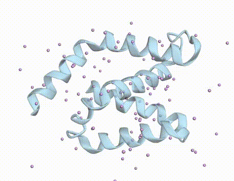
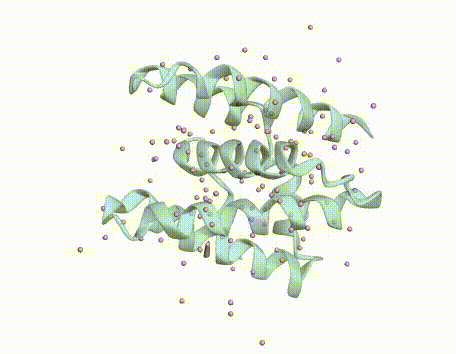
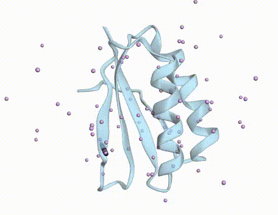
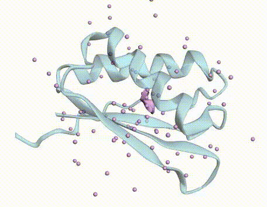

# Protein Toaster (HiReFlow)
> Drop in some raw Gaussian noise, let it toast for a bit, and out pops a crisp protein domain. :D

### Quick Specifications
* **Framework:** Flow Matching with Global Alignment (HiReFlow)
* **Training Foundation:** 12,036 continuous domain backbones filtered from SCOPe 40%

`Protein Toaster` globally aligns the source distribution (noise) with the target distribution (protein domains) using **Hierarchical Refinement: Optimal Transport (HiRef)**, acting as a prior during training to produce straighter trajectory paths for inference [1]. 

<div style="display: grid; grid-template-columns: repeat(2, 1fr); gap: 10px;">
  
  
  
  
</div>

The **purple spheres** show the trajectory as they converge to the final structure. The **light blue** structure is refolded sample.

## Approach
### 1. Flow Matching Framework using HiRef-OT
Traditional Flow Matching frameworks generate vector fields across unstructured pairings between a source and target distribution. However, by introducing structure to these pairings using **Optimal Transport**, a prior can be introduced to the data which can straighten these vector fields. Notably, *FoldFlow-OT* is an existing framework which uses mini-batch OT to align noise with protein structures prior to training [2]. Though, this approach has a risk of introducing mini-batch bias, where solving optimal transport on localized subsets yields sub-optimal couplings.

To bypass this limitation, `Protein Toaster` implements Hierarchical Optimal Refinement (HiREF) to compute a global alignment across the entire dataset distribution, eliminating the effects of mini-batch bias and enabling the model to learn straighter transport trajectories [1].

### 2. Dynamic Composite-Splitting Algorithm
HiRef requires the input data to be highly divisible (composite) [1]. To ensure compatability, `Protein Toaster` uses a dynamic algorithm that calculates the closest composite numbers to the train/val/test splits, partitioning the data into highly divisible groups adequate for alignment using this method. 
> **Ratio Preservation:** Because this optimization shifts the partition boundaries by only a negligible handful of samples out of thousands, the intended target split ratio is functionally unaffected (e.g., 80/10/10 to 80.19/10.1/9.71).

### 3. Parallelised Asynchronous Background Alignment
HiRef was a major bottleneck when run sequentially as it left the GPU idle between epochs, while the alignment occurred. To alleviate this limitation, the alignment is run asynchronously on the CPU alongside a training epoch. Furthermore, the alignment can be parallelised across a multi-core CPU worker pool to speed up processing, ultimately driving the effective wait time for the alignment step down to zero between epochs.

### 4. Frenet-Serret Backbone Representation
Rather than calculating continuous vector fields directly over the $\mathbb{R}^3$ translations and $SO(3)$ rotations of the $SE(3)$ manifold, `Protein Toaster` represents the protein backbone as a cloud of alpha-carbon ($C_\alpha$) points. This allows the construction of generative vector fields entirely within the $\mathbb{R}^3$ coordinate space.

To ensure complete coordinate-frame independence and rotational invariance, the alpha-carbon cloud is parameterized using localized **Frenet-Serret frames** and processed by the network using an Invariant Point Attention (IPA) architecture [3]. This approach is similar to *Genie* but uses an Optimal Transport Flow Matching Framework, with HiRef [4].

This formulation works well with HiRef. While frameworks such as *FoldFlow-OT* model trajectories over non-Euclidean manifolds ($SO(3)$), operating in the $\mathbb{R}^3$ domain alone provides the advantage of only needing a squared Euclidean cost, which matches the requirements for the HiRef [1].

## Benchmark Evaluation & Results
Protein Toaster was evaluated with varying step rates (25, 50, and 250 steps), generating a total of 1185 proteins between 50 and 128 residues. For each length, 15 unique backbones were sampled, each backbone was processed through *ProteinMPNN* to yield 8 sequences and then refolded with *ESMFold*.

- **Confidently Designable** is a generated backbone for which at least one ProteinMPNN-designed sequence folds with a pLDDT > 0.7 and an scTM > 0.5.
- **Diversity** is measured as the percentage of generated backbones that represent a unique structural fold, determined by hierarchical clustering using a TM-score threshold of 0.6. 
- **Novelty** is measured as the percentage of confidently designable backbones that have a maximum TM-score below 0.5 to any structure in the reference dataset.

| Inference Steps | Confidently Designable | Diversity | Novelty |
| :---: | :---: | :---: | :---: |
| **25 Steps** | 35.7% | 14.8% | 2.2% |
| **50 Steps** | 30.5% () | 13.0% | 1.4% |
| **250 Steps** | 26.0%  | 11.8% | 0.6% |

Protein Toaster generates **63.1% primarily α-helical**, **14.2% primarily β-strand**, and **17.8% α/β-mixed** domains.

# Installation
```bash
# Clone the repository
git clone https://github.com/ToastiestToaster/Protein-FM-HiREF.git
cd Protein-FM-HiREF

# Create environment
conda create -n toast python=3.10 -y
conda activate toast
pip install -r requirements.txt
```
# Inference & Training
### Inference
Open `sample_protein.ipynb` and run the necessary cells for inference.


### Training
Training requires a single command:
```bash
python -m train.py pdb_dir=/path/to/training/dir
```
You may need to make your own custom `dataset.py` depending on the dataset.

### References
[1] Halmos, P., Gold, J., Liu, X., & Raphael, B. (2025). "Hierarchical Refinement: Optimal Transport to Infinity and Beyond." *International Conference on Machine Learning (ICML)*.

[2] Bose, A. J., et al. (2024). "SE(3)-Stochastic Flow Matching for Protein Backbone Generation." *International Conference on Learning Representations (ICLR)*.

[3] Jumper, J., Evans, R., Pritzel, A., et al. (2021). "Highly accurate protein structure prediction with AlphaFold." *Nature*, 596(7873), 583–589.

[4] Lin, Y., & AlQuraishi, M. (2023). "Generating Novel, Designable, and Diverse Protein Structures by Equivariantly Diffusing Oriented Residue Clouds." *International Conference on Machine Learning (ICML)*.